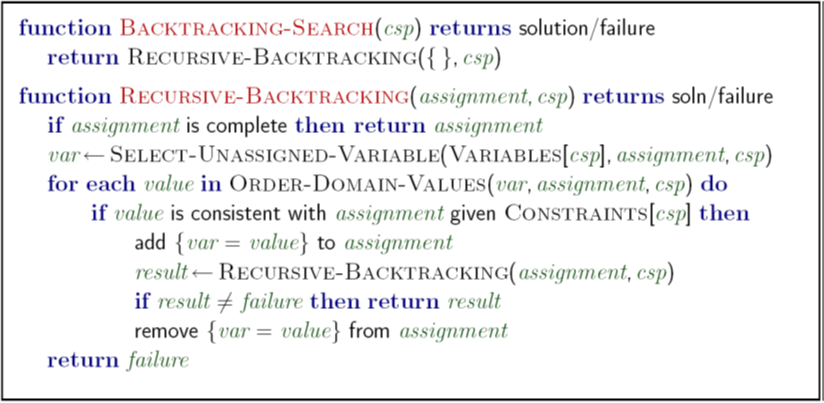
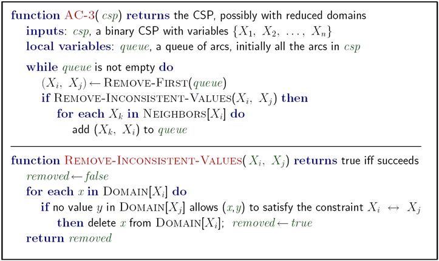
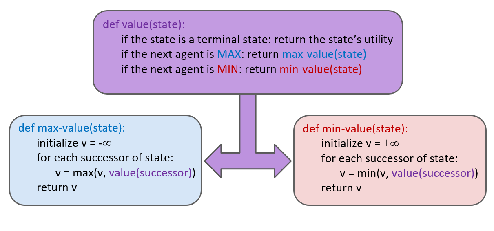
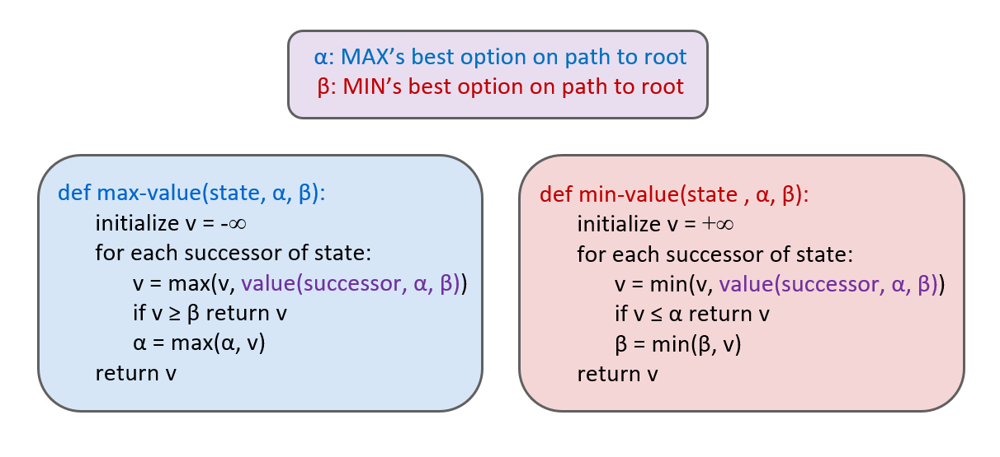
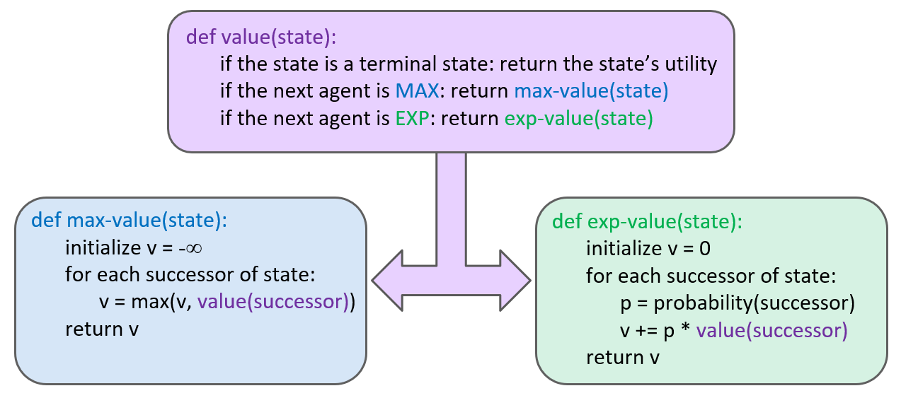

# search

#### Search Problem

- A state space
- A successor function (return state, action, cost)
- A start state and a goal test

#### Uninformed Search

|                      | complete                           | optimal                                 | Time    | Space   | Strategy                   |
| -------------------- | ---------------------------------- | --------------------------------------- | ------- | ------- | -------------------------- |
| Depth-First Search   | :heavy_check_mark: (prevent cycle) | ❌                                       | O(b^m^) | O(bm)   | expand the deepest node    |
| Breadth-First Search | :heavy_check_mark:                 | :heavy_check_mark: (if costs are all 1) | O(b^t^) | O(b^t^) | expand the shallowest node |
| Uniform-Cost Search  | :heavy_check_mark:                 | :heavy_check_mark:                      | O(b^t^) | O(b^t^) | expand the least cost node |

(Planning vs. replanning)

(Iterative Deepening combine DFS & BFS)

#### Heuristics

- A function estimates how close is the state to the goal
- Designed for a particular problem
- **Tree** Search: should be **admissible** for A* to be optimal: 0 ≤ h(n) ≤ h^*^(n) (heuristic cost <= actual cost to goal)
- Trade-of between quantity & time complexity. Normally the closer to the actual cost, the better it will be. (you can max two heuristics)
- **Graph** Search(avoid expanding a node twice): should be **consistency**: h(c) - h(a) ≤ cost(a to c) (heuristic "arc" cost ≤ actual cost for each arc)

#### Informed Search

|               | complete           | optimal                                           | Strategy                                               |
| ------------- | ------------------ | ------------------------------------------------- | ------------------------------------------------------ |
| Greedy Search | :heavy_check_mark: | ❌                                                 | expand the least cost node according to the heuristics |
| A* Search     | :heavy_check_mark: | :heavy_check_mark:(when admissible & consistency) | combine UCS & Greedy                                   |

#### Tree Search Pseudo-Code

#### Graph Search Pseudo-Code

### CSP (Constraint Satisfaction Problem)

**What is CSP?** (map coloring, n-queen)

- Compared to the **Planning**: sequences of action
  - the important thing is the path to the goal
  - paths have various depth, costs
- CSP is **Identification**: assignments to valuables
  - the goal itself is important, not the path
  - the goal are in the same depth (So, the algorithms are based on the DFS)

**How to represent a CSP?** (represent smaller, problem easier)

- **Variables**
- **Domains**
- **Constraints**
  - either be **implicit**: rules can be write in a function to check if violate constraints
  - or **explicit**: some sets of assignments that won't violate constraints
  - Unary constraints, Binary constraints, and so on: (n variables)
- **Solutions**: with all variables being assigned and satisfying all constrains

**Algorithm:**

- **Backtracking**: basic

- **Ordering:**

  - **Minimum Remaining Values**: when selecting variable to assign, choose the hardest one to **fail faster** (cuz u eventually need to assign it)   Choose the variable with minimum remaining value
  - **Least Constraining Value**: when selecting values in domain, choose the easiest one for avoid failure, for code: compute total costs after enforce arc-consistency and choose the smallest cost one.

- **Filtering:** keep tracking of unsigned variables and cross off bad options

  | type                       | enable                              | weakness                  |      |
  | -------------------------- | ----------------------------------- | ------------------------- | ---- |
  | forward checking           | see failure one step ahead          | can't see further         |      |
  | arc-consistency (n^2^b^3^) | can detect failure many steps ahead | can't detect all failures |      |

  - detect inevitable failure early
  - turn some unnecessary non-polynomial time to **polynomial time**

- **Structure:**

  - **Tree-Structured:** (no loops)
    - Remove backward
    - Assign  forward
    - Runtime: O(n d^2^)
  - **Nearly Tree-Structured:** Cut some important nodes
    - Runtime: O(d^c^ (n-c) d^2^) very fast for small c

- **Iterative min-conflicts:** randomly assignment with min-conflicts iterative improving. sometimes can be fast, but most time, won't

#### Backtracking Search Pseudo-Code

#### Arc Consistency Pseudo-Code

#### Local Search

**Compare:**

- Tree Search keeps unexplored alternatives on the fringe (ensures completeness)
- Local Search: improve a single option until you can't make it better (no fringe)
- Much faster and more memory efficient, but incomplete and suboptimal.

**Algorithm:** 

- **Simulated Annealing**: Escape local maxima by allowing downhill moves, but make them rarer as time goes on
- **Genetic Algorithm**

#### Simulated Annealing Pseudo-Code

### Adversarial Search (Minimax)

#### Minimax(dispatch) Pseudo-Code

without pruning, the behavior would like DFS:  run time: O(b^m^),  space: O(bm)

#### Alpha-Beta Pseudo-Code

with limited source when you can't see the end of the game, you need to write a good evaluate function to guide agent to win.

Minimax will see future very pessimistic, leads to low score even if you can get higher when opponent's strategy isn't that good. So expectimax may performance better.

#### Expectimax Pseudo-Code

