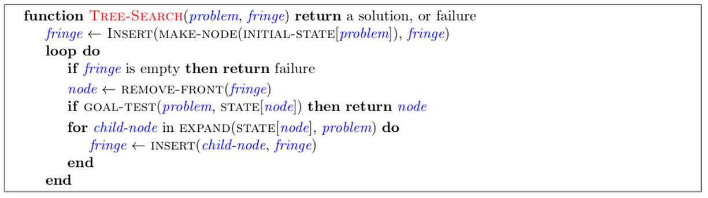
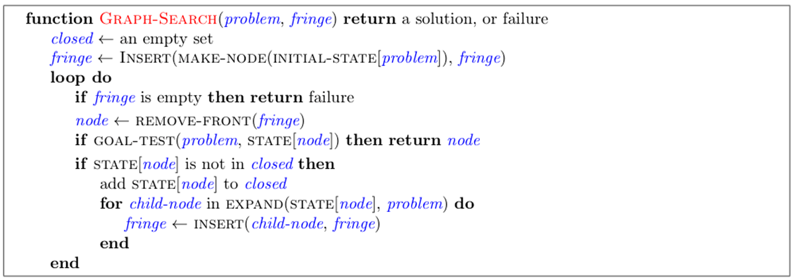

# search

#### Search Problem

- A state space
- A successor function (with actions, costs)
- A start state and a goal test

#### Uninformed Search

|                      | complete                           | optimal                                 | Time    | Space   | Strategy                   |
| -------------------- | ---------------------------------- | --------------------------------------- | ------- | ------- | -------------------------- |
| Depth-First Search   | :heavy_check_mark: (prevent cycle) | ❌                                       | O(b^m^) | O(bm)   | expand the deepest node    |
| Breadth-First Search | :heavy_check_mark:                 | :heavy_check_mark: (if costs are all 1) | O(b^t^) | O(b^t^) | expand the shallowest node |
| Uniform-Cost Search  | :heavy_check_mark:                 | :heavy_check_mark:                      | O(b^t^) | O(b^t^) | expand the least cost node |

(Planning vs. replanning)

(Iterative Deepening combine DFS & BFS)

#### Heuristics

- A function estimates how close is the state to the goal
- Designed for a particular problem
- **Tree** Search: should be **admissible** for A* to be optimal: 0 ≤ h(n) ≤ h^*^(n) (heuristic cost <= actual cost to goal)
- Trade-of between quantity & time complexity. Normally the closer to the actual cost, the better it will be. (you can max two heuristics)
- **Graph** Search(avoid expanding a node twice): should be **consistency**: h(c) - h(a) ≤ cost(a to c) (heuristic "arc" cost ≤ actual cost for each arc)

#### Informed Search

|               | complete           | optimal                                           | Strategy                                               |
| ------------- | ------------------ | ------------------------------------------------- | ------------------------------------------------------ |
| Greedy Search | :heavy_check_mark: | ❌                                                 | expand the least cost node according to the heuristics |
| A* Search     | :heavy_check_mark: | :heavy_check_mark:(when admissible & consistency) | combine UCS & Greedy                                   |

#### Tree Search Pseudo-Code

#### Graph Search Pseudo-Code

