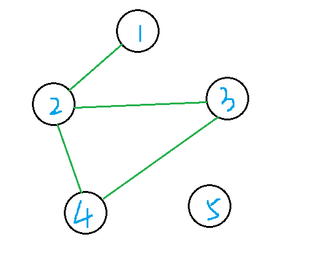

# section2

1. **Search and Heuristics**:

   1. ~~(M * N) ^4Vmax^~~  4MN(V~max~ + 1)
   2. No. Because when having higher velocity, you can reach a farer place with less cost, which Manhattan distance will not consider.
   3. Heuristic: Manhattan distance / current velocity
   4. ~~Nor complete or optimal~~. When having the wrong heuristic to estimate how far is the goal, it may never show you where the goal is, and you just trap into a infinite path.
   5. Nope, in a graph search, *admissible* heuristic won't guarantee an optimal solution, while consistent one will.
   6. Easy to implement.

2. **Course Scheduling**:

   1. CSP form:
      1. values: every class has a variable in domain {A, B, C}
      2. domains after enforcing unary constraints:
         1. {A, C}
         2. {A}
         3. {B,C}
         4. {B,C}
         5. {A,B}
      3. constraints (implicit):
         1. the variable of class 1 and 2 should be different
         2. 2 & 3
         3. 2 & 4
         4. 3 & 4
   2. 

3. **Trapped Pacman**:

   1. binary constraints: 

      1. (1, 2), (1, 6), (4, 5), (5, 6) are in domain: {(P, P) (P, E) (P, G) (E, P) (G, P)}
      2. (2, 3), (3, 4) are in domain: {(G, E) (E, G)}

   2. |      |  0   |  0   |
      | :--: | :--: | :--: |
      |  0   |      |      |
      |  0   |      |      |
      |  0   |      |      |
      |      |  0   |  0   |
      |      |  2   |      |

   3. X~1~ and X~5~

   4. ~~X1,X5 is P; X2,X3X4: G or E; X6: P or E~~

   5. cutting a random node, so that the remaining nodes form a tree, tree structure can be solved in d*(n-1)*d^2^

   6. ~~2^n^~~